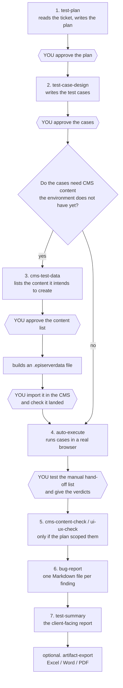

# Ritus QA

A skill pack for manual QA engineers working on Optimizely CMS + frontend projects. Works with Claude Code and GitHub Copilot CLI.

## What it does

End-to-end QA workflow plus on-demand local exports:

1. **test-plan** — fetch a Jira/ADO ticket and produce a test plan
2. **test-case-design** — generate labeled test cases (`automatable` / `assisted` / `manual`)
3. **cms-test-data** — generate an importable Optimizely CMS content package (`.episerverdata`) for the content a ticket's test cases need
4. **auto-execute** — run automatable cases in a real browser via Playwright MCP, hand off manual cases with evidence packs, and record a Playwright regression script
5. **cms-content-check** — Optimizely edit-mode ↔ frontend checklist
6. **ui-ux-check** — numeric design/responsive/a11y measurement (no LLM eyeballing)
7. **bug-report** — standardized English bug reports
8. **test-summary** — client-facing summary with honest automated/manual coverage
9. **artifact-export** — export existing Markdown QA artifacts to supported client-shareable formats on demand
10. **qa-workflow** — orchestrates the QA flow per ticket

## How the pipeline works

Written for QA engineers. You do not need to know anything about AI to use this.

### What you are actually working with

"The agent" is Claude Code or GitHub Copilot CLI — a chat window in your terminal. This repo adds no intelligence to it; it adds **written procedures**. Each skill is a checklist that tells the agent what to do, what to write down, and — most importantly — **when to stop and ask you**.

Everything it produces is an ordinary Markdown file under `.qa/<ticket-id>/` in the project you are testing. Nothing goes into a database or the cloud. You can open, edit, or delete any of those files at any time, and the next stage reads your edited version.

You are still the tester. The agent does the typing, the clicking, and the paperwork; every judgment call stays yours.

### The flow



### Who does what

| Stage | What the agent does | What you do |
|---|---|---|
| **test-plan** | Reads the ticket from Jira/ADO — read-only — and writes a plan: scope, risks, what to test and how | Read it and correct anything it misunderstood. It is your file |
| **test-case-design** | Turns the plan into a numbered test case table and labels each case `automatable`, `assisted`, or `manual` | Check the cases cover what actually matters. On a re-test, approve its rerun / skip / amend list — a wrong `skip` is the one mistake nothing else catches |
| **cms-test-data** | Works out what CMS content the cases need and lists it in `test-data.md` *before* building anything | Approve or amend the list, then import the generated file yourself under **Admin → Import Data** |
| **auto-execute** | Opens a real browser and runs the `automatable` cases, checking the page's actual content. Pauses on `assisted` cases at the point a human is required (login, captcha, payment) | Take over when it pauses. Then work through the manual hand-off list and record your verdicts |
| **cms-content-check** / **ui-ux-check** | Walks an Optimizely edit-mode checklist; measures spacing, sizes and breakpoints as numbers read off the page | Answer the checklist questions and give the visual verdicts |
| **bug-report** | Writes a standard bug report per confirmed finding into `bugs/` | Confirm it is genuinely a bug first, then copy it into Jira/ADO yourself |
| **test-summary** | Aggregates this round's results and open bugs into a client-facing summary | Read it before it goes anywhere. You own what reaches the client |

### Where it stops and waits for you

It never chains stages silently. Before every transition it shows one line — what it produced and where — and waits for your go-ahead. Four of those stops are hard ones:

- **Before it changes existing test cases on a re-test.** It shows you what it would rerun, skip, amend, or retire, with a reason per case, and does nothing until you approve.
- **Before it builds a CMS package.** You see the full list of content and property values first, including the fields it knows it cannot fill.
- **After it builds the package.** It waits while you import it and confirm the content is really there.
- **After the browser run.** Cases it could not judge come back to you as a hand-off list with screenshots — and, where a Figma link exists, the design export next to them.

You can skip any stage by saying so ("skip the UI check"). The skip is recorded in the summary's Remaining Risks, so nobody is misled about what was covered.

### What it will not do

- **It never writes to Jira or Azure DevOps.** It only reads the ticket. Filing bugs in the tracker stays a manual step.
- **It never touches the CMS.** It writes a file; you import it.
- **It never uploads anything.** Exports stay local under `.qa/<ticket-id>/exports/`.
- **It never judges a screenshot by eye.** If confirming a result needs a human to look at it, the case is demoted to `manual` and handed to you with evidence — it will not guess.
- **A `pass` means one narrow thing:** the specific check it wrote held true. It does not mean the page looks right. That verdict is only ever yours.
- **It never invents a value it cannot verify.** Fields the CMS generator has no proven way to fill are left empty and listed by name, so a blank in the CMS is not mistaken for a site bug.
- **It never deletes a test case.** Retired cases move to a `## Deprecated` section and IDs are never reused, so history stays readable.

### If it gets something wrong

Edit the Markdown. Every artifact is a plain file, later stages read whatever is in it, and your edits survive re-runs and exports. You can also run any stage on its own — "write test cases for PROJ-123" — without going through the whole pipeline.

## Prerequisites

- [Bun](https://bun.sh) 1.3+
- Local Bun-managed export dependencies from the plugin root `package.json` / `bun.lock`: `exceljs`, `docx`, and `pdfkit`
- Playwright MCP runs via `npx @playwright/mcp@latest`; Figma MCP is remote and optional
- For `cms-test-data`: a content-types export from the site under test at `.qa/cms-schema/content-types.episerverdata`, produced once in the CMS under **Admin → Export Data** with **content types only** (never a content export — it carries real customer data). Re-export it only when the site's schema changes.

## Install

**Claude Code:**

1. Add marketplace
2. Install Ritus QA

```text
/plugin marketplace add precise-alloy/ritus-qa
/plugin install ritus-qa
```

**GitHub Copilot CLI:**

1. Add the marketplace
2. Fetch the plugin manifest
3. Install Ritus QA

```text
/plugin marketplace add precise-alloy/ritus-qa
/plugin marketplace browse ritus-qa-marketplace
/plugin install ritus-qa@ritus-qa-marketplace
```

## Setup

1. Create `.qa/.env.local` in the project under test (copy `templates/env.local.example` or paste the block below) and fill in Jira and/or ADO credentials plus the test environment URL. `.qa/` is git-ignored — never commit real tokens.

   ```dotenv
   # Ritus QA configuration — copy this file to .qa/.env.local and fill in values.
   # .qa/ is git-ignored; never commit real tokens.

   # --- Jira (leave blank if this project uses ADO only) ---
   JIRA_BASE_URL=https://client.atlassian.net
   JIRA_EMAIL=qa@example.com
   JIRA_PAT=

   # --- Azure DevOps (leave blank if this project uses Jira only) ---
   AZURE_DEVOPS_READONLY_PAT=
   AZURE_DEVOPS_ORG=client-org
   AZURE_DEVOPS_PROJECT=client-project

   # --- Test target ---
   TEST_BASE_URL=https://staging.client-site.com
   ```

2. Register the MCP servers in the **project under test's** `.mcp.json` (the plugin ships no `.mcp.json` — each project owns its config). Add this to the project's `.mcp.json`:

   ```json
   {
     "mcpServers": {
       "playwright": {
         "command": "npx",
         "args": ["@playwright/mcp@latest", "--isolated", "--caps=testing", "--output-dir", ".qa/screenshots"]
       },
       "figma": {
         "type": "http",
         "url": "https://mcp.figma.com/mcp"
       }
     }
   }
   ```

   - The skills call the servers by the plain names `playwright` / `figma`. If the project already has a `playwright` server, merge the args above into it rather than adding a duplicate.
   - Playwright MCP allows all origins by default, so no origin flag is needed for testing across client environments.
   - Figma is optional — omit the `figma` block if the project has no designs to reference.
   - **You do not register `"cms-test-data"` yourself.** The plugin bundles that server in its own `.mcp.json`, which runs the published npm package `cms-test-data-mcp` via `bunx`. The host starts it when the plugin is enabled; `bun` must be on your `PATH`. Only `playwright` and `figma` are yours to configure: they belong to the project under test, and MCP servers use last-wins precedence, so bundling them would override whatever the project already had under those names.

## Usage

Tell your agent: **"Start QA for PROJ-123"** (or an ADO work item id). Or use any skill standalone: "write test cases", "run the tests", "check CMS content", "write a bug report", "wrap up testing", or "export test cases to Excel".

Artifacts land in `.qa/<ticket-id>/` (git-ignored): `<ticket-id>-plan.md`, `<ticket-id>-test-cases.md`, `execution-results.md`, `bugs/`, `summary.md`, `screenshots/`, `automation/`, `test-data/`, `rounds/`, and `exports/`. The CMS schema export is shared across tickets at `.qa/cms-schema/content-types.episerverdata`.

## Re-testing a ticket that changed

When a ticket is updated after QA already tested it, run the same pipeline again — the skills notice the existing artifacts and amend them instead of starting over.

`test-plan` snapshots the previous `ticket.json` to `rounds/ticket-r<N-1>.json`, diffs the fields that carry QA meaning, and appends a dated entry to the plan's `## Change Log`. `test-case-design` then classifies every existing case as **rerun**, **skip**, **amend**, **new**, or **deprecated**, and holds for your approval before touching the file — a wrong `skip` is the one failure mode no test can catch, so that call is yours. Case IDs are permanent, and retired cases move to a `## Deprecated` group rather than being deleted. The approved classification is written into that round's Change Log entry, which is where `test-summary` later reads the reasons from.

`auto-execute` appends the round's rows to `execution-results.md` rather than overwriting it, so a case that failed in round 1 and passed in round 2 shows both. A skipped case gets no row at all — its absence is the record. `test-summary` reports the current round only, never blending rounds into one pass rate, names every case that was not re-run along with why it was judged unaffected, and reconciles each open bug against this round's result so a defect whose case now passes stops counting against the recommendation.

If the diff shows nothing changed and every case passed, the workflow says so and stops instead of regenerating identical artifacts.

## CMS test data

`cms-test-data` reads the ticket's test cases and plans the content they need. It writes `.qa/<ticket-id>/test-data/test-data.md` — the review surface, listing every item with the property values it will be given — plus `content-plan.json` for the generator, and asks the QA to approve the data. Only then does it build `.qa/<ticket-id>/test-data/<ticket-id>.episerverdata`. The generator never touches the CMS: the QA exports the schema once, and imports the package under **Admin → Import Data**, choosing the destination there.

Broadly: pages, blocks, nested page trees, raster image media, and the common property kinds — text, HTML, ContentArea, content references and link collections — plus `{{date:±Nd}}` / `{{date:±Nh}}` / `{{date:±Nm}}` tokens for dates relative to now. Images are generated as placeholder PNGs at whatever size the plan asks for, and one image referenced by many pages stays one item and one file.

Some things it deliberately does not produce — SVG, PDF and video media, inline block properties, unpublished content, more than one language — and any property type it has no proven sample for is written empty with a warning rather than guessed. `test-data.md` lists every such field so a blank value in the CMS is not mistaken for a site bug.

**The generator reports its own current capabilities.** Its `usage_guide` tool returns the authoritative list — what it produces, what it refuses, the limits it enforces, and how re-import behaves — rendered from the constants the code actually enforces. The skill reads that at run time, so this summary is an orientation for choosing whether to install the plugin, not a specification. Where the two differ, `usage_guide` is right.

### Where the generator lives

The generator is developed and released from its own repository, [cms-test-data-mcp](https://github.com/precise-alloy/cms-test-data-mcp), and published to npm as `cms-test-data-mcp`. It is not part of this repo: it releases on its own cadence, and a plugin install is a copy of this repo without `node_modules`, so running the server from here would leave Bun auto-installing from its global cache — which fails on Windows.

To move to a newer generator, bump the pinned version in `.mcp.json`. Nothing else changes; `bun test` checks that the pin is an exact version rather than a floating one, because an unpinned spec is re-resolved on every session start (~11s) instead of being served from cache (~0.7s).

## QA artifact export

`artifact-export` exposes the supported local export matrix:

| Markdown source | Export path |
|---|---|
| `.qa/<ticket-id>/<ticket-id>-test-cases.md` | `.qa/<ticket-id>/exports/<ticket-id>-test-cases.xlsx` |
| `.qa/<ticket-id>/<ticket-id>-plan.md` | `.qa/<ticket-id>/exports/<ticket-id>-plan.docx`, `.qa/<ticket-id>/exports/<ticket-id>-plan.pdf` |

The Markdown file remains the source of truth. Exporting never regenerates content, so any manual Markdown edits carry straight into the next export. Migration is strict: there is no legacy fallback and no automatic rename. The skills and exporter only read/write the canonical ticket-prefixed Markdown and export filenames.

Plan DOCX/PDF exports render supported GFM Markdown semantics rather than copying Markdown delimiters. Images become alt text; raw HTML becomes text; only http/https/mailto links are clickable, while unsafe links remain plain text labels.

`<plugin-root>` is the installed plugin directory containing `package.json`, `bun.lock`, and `scripts/export-artifact.ts`. Run every CLI command from `<project-root>`, the project-under-test root that contains `.qa`. Invoke the CLI by the plugin-root script path so `.qa/<ticket-id>/...` remains in the target project. Do not change to `<plugin-root>` to run an export.

```powershell
# Current directory: <project-root>
bun "<plugin-root>\scripts\export-artifact.ts" --ticket PROJ-123 --artifact test-cases --format xlsx
bun "<plugin-root>\scripts\export-artifact.ts" --ticket PROJ-123 --artifact test-plan --format docx,pdf
```

To regenerate the SM26-207 plan exports from the project-under-test root:

```powershell
bun "<plugin-root>\scripts\export-artifact.ts" --ticket SM26-207 --artifact test-plan --format docx,pdf
```

`<ticket-id>-test-cases.xlsx` preserves the portable `Priority` and `Completed` values as plain text in real Microsoft Excel dropdowns backed by the hidden `_Validation` sheet workbook named ranges `PriorityOptions` and `CompletionStatusOptions`:

- `High`
- `Medium`
- `Low`

- `Not run`
- `Done`
- `Fail`

When `.qa/<ticket-id>/exports/<ticket-id>-test-cases.xlsx` already exists, the exporter supports carry-forward of existing `Completed` values by test-case ID into the regenerated workbook. New IDs default to `Not run`; removed IDs are not copied forward.

Exports stay local under `.qa/<ticket-id>/exports/`. The skill and CLI do **not** upload anything to Microsoft 365, Google Drive, Google Sheets, or any other cloud service.

### Compatibility notes

- **Microsoft 365 (Windows/macOS):** `<ticket-id>-test-cases.xlsx`, `<ticket-id>-plan.docx`, and `<ticket-id>-plan.pdf` are first-class local outputs.
- **Google Drive:** QAs can upload the generated DOCX/PDF/XLSX files manually for sharing or preview.
- **Google Sheets:** opening `<ticket-id>-test-cases.xlsx` through Drive/Sheets may normalize nonessential formatting, but Google Sheets dropdown conversion/editing for `Priority` and `Completed` is not supported.

### Manual compatibility checklist

Run this release checklist manually after generating the local exports:

1. Open `<ticket-id>-test-cases.xlsx`, `<ticket-id>-plan.docx`, and `<ticket-id>-plan.pdf` in Microsoft 365 on Windows or macOS.
2. Upload `<ticket-id>-test-cases.xlsx`, `<ticket-id>-plan.docx`, and `<ticket-id>-plan.pdf` to Google Drive and verify DOCX/PDF preview.
3. Confirm the visible headers are exactly `ID`, `Group`, `Title`, `Priority`, `Triage`, `Preconditions`, `Steps`, `Expected Result`, `Completed`; `Completed` is the final column; column D is `Priority`; and column I is `Completed`.
4. Select a `Priority` cell in column D and a `Completed` cell in column I in Microsoft Excel. For each selected cell, confirm the dropdown arrow appears and its options are exactly `High` / `Medium` / `Low` or `Not run` / `Done` / `Fail`.
5. Select `Medium` and `Done`, save the workbook, then re-export it to verify carry-forward by test-case ID.

## E2E regression script generation

After `auto-execute` runs, it records the executed steps into a standalone Playwright spec via `scripts/record-playwright.ts`. The agent asks **once per project** which style you want and remembers the answer in `.qa/e2e-style`:

| Style | What you get | Best when |
|---|---|---|
| **structured** | Specs follow (or scaffold) a full e2e suite: `playwright.config.ts`, two-layer page objects, projects by scope (`smoke`/`regression`/`visual`/`cms`), CMS auth via `storageState`, eslint/prettier/tsconfig | You want a maintainable e2e suite to grow over time |
| **one-file-per-ticket** | A single self-contained spec at `.qa/<ticket-id>/automation/<ticket-id>.spec.ts`, runnable with `bunx playwright test` — no page objects, no scaffold | You just want a runnable record of this ticket's cases with minimal ceremony |

**structured, project already has an e2e suite** (`playwright.config.ts`): the spec is written into your existing structure, untouched config.

**structured, no e2e suite:** the agent offers to scaffold the bundled template (`templates/e2e/`). Then run once in the scaffolded project:

```powershell
npm install
npx playwright install
cp .env.example .env   # fill in values
npx playwright test --project regression
```

The template's own dependencies (`@playwright/test`, `dotenv`, lint/format) live in the **scaffolded project**, not the plugin.

**one-file-per-ticket:** nothing to install in your project; the spec lives under `.qa/` and runs standalone.

## Development

```powershell
bun test
```
